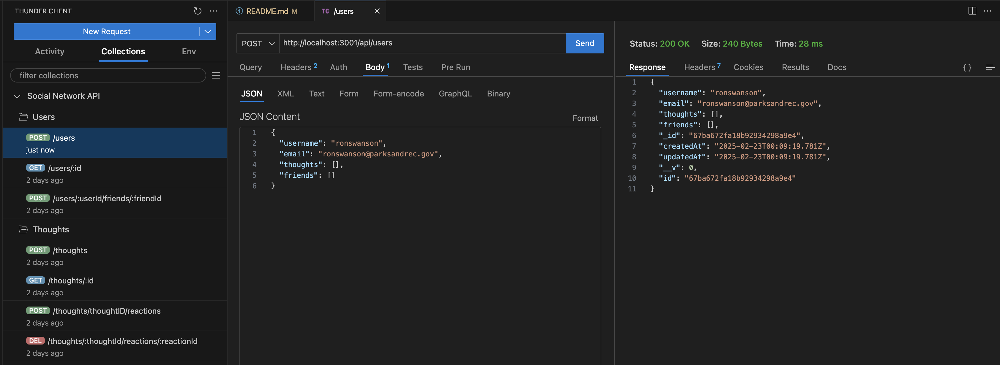

# Social Network API

## Description

This project is a backend API for a social networking web application. It allows users to share thoughts, react to friends' thoughts, and manage a friend list. The application is built using Express.js for routing, MongoDB as the database, and Mongoose as the ODM (Object Data Modeling) library. Additionally, timestamps for data entries are formatted using the JavaScript Date object or an optional date library.

## Usage

- The application is designed to be tested using Insomnia or Postman.
- The API runs on http://localhost:3001 by default.
- Use the available GET, POST, PUT, and DELETE routes to interact with the API.

## API Routes

### Users

- GET /api/users - Get all users
- GET /api/users/:id - Get a single user by ID
- POST /api/users - Create a new user
- PUT /api/users/:id - Update a user by ID
- DELETE /api/users/:id - Delete a user by ID

### Friends

- POST /api/users/:userId/friends/:friendId - Add a friend
- DELETE /api/users/:userId/friends/:friendId - Remove a friend

### Thoughts

- GET /api/thoughts - Get all thoughts
- GET /api/thoughts/:id - Get a single thought by ID
- POST /api/thoughts - Create a new thought
- PUT /api/thoughts/:id - Update a thought by ID
- DELETE /api/thoughts/:id - Delete a thought by ID

### Reactions

- POST /api/thoughts/:thoughtId/reactions - Add a reaction to a thought
- DELETE /api/thoughts/:thoughtId/reactions/:reactionId - Remove a reaction from a thought

